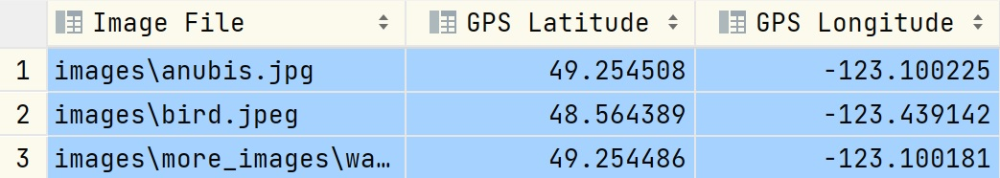
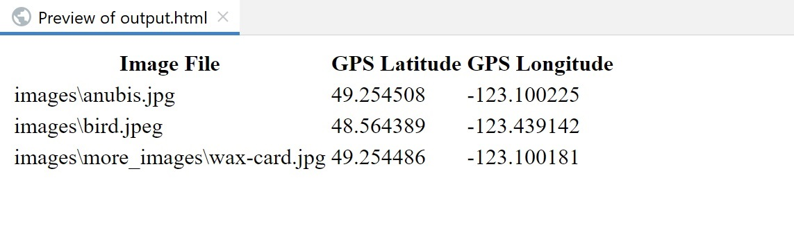

### EXIF Reader

This command-line utility written in Go reads the EXIF data from images in a specified directory and generates a CSV file and an HTML file with the extracted attributes.

---

### Problem

Given a directory containing images, including a sub-directory with images, the goal is to create a command-line tool that reads the EXIF data from the images and writes the following attributes to a CSV file:

1. Image file path
2. GPS position latitude
3. GPS position longitude

The program should also be capable of generating an HTML file to display the extracted data in a table format.

---

### Dependencies

- Go: Visit [https://go.dev](https://go.dev) for installation instructions.
- [go-exif](https://github.com/dsoprea/go-exif): A Go library for extracting EXIF metadata from images.

---

### Usage

1. Clone the repository:
   git clone https://github.com/yourusername/exif-reader.git

2. Navigate to the project directory:
   cd exif-reader

3. Build the executable:
   go build

4. Run the program:
   ./exif-reader --directory /path/to/images

Replace `/path/to/images` with the actual directory path containing the images you want to process.

5. The program will generate two output files:

- `output.csv`: CSV file containing the image file paths, GPS latitude, and GPS longitude.
- `output.html`: HTML file displaying the extracted data in a table format.

---

### Implementation Details

The `main.go` file contains the code for the EXIF Reader utility. Here's an overview of its implementation:

1. The program uses the `go-exif` library to extract EXIF data from images.

2. It accepts a directory path as a command-line argument, which specifies the directory to process.

3. The program recursively traverses the directory and its subdirectories using the `filepath.Walk` function.

4. For each image file encountered, it reads the EXIF data, extracts the GPS latitude and longitude, and stores them in memory.

5. After processing all the images, the program writes the extracted attributes to a CSV file (`output.csv`) using the `encoding/csv` package.

6. It also generates an HTML file (`output.html`) with a table displaying the extracted data.

---

### Example Output

#### CSV Output

#### HTML Output

---

### Time Complexity

The time complexity of the program can be analyzed as follows:

- Directory traversal: The time complexity of traversing the directory and its subdirectories using `filepath.Walk` is proportional to the number of files and directories. Let's denote the total number of files and directories as `n`. In the worst case, if there are `n` files and directories, the time complexity would be O(n).

- Reading EXIF data: The time complexity of reading EXIF data from an image file depends on the size of the file and the complexity of the EXIF decoding algorithm. Let's denote the size of the largest image file as `m`. The time complexity of reading EXIF data can be approximated as O(m).

- Extracting GPS data: The time complexity of extracting GPS data from the EXIF data is considered constant or O(1) since it involves accessing specific fields in the EXIF data.

- Writing to CSV and HTML files: The time complexity of writing a single row of data to the CSV file and the HTML file is considered constant or O(1). The total time complexity depends on the number of images processed, which is proportional to the number of files in the directory tree (`n`).

Considering the above factors, the overall time complexity can be approximated as O(n + m) in the worst case scenario.

---

### Space Complexity

The space complexity of the program can be analyzed as follows:

- Directory tree: The space complexity for storing the directory tree depends on the depth and branching factor of the tree. In the worst case, if there are `n` files and directories, the space complexity for storing the directory tree can be approximated as O(n).

- EXIF data: The space complexity for storing the EXIF data of the largest image file depends on the size of the file. Let's denote the size of the largest image file as `m`. The space complexity for storing the EXIF data can be approximated as O(m).

- Additional variables: The space complexity for additional variables used in the code is considered constant or O(1). These variables do not depend on the input size.

Considering the above factors, the overall space complexity can be approximated as O(n + m) in the worst case scenario.

---
